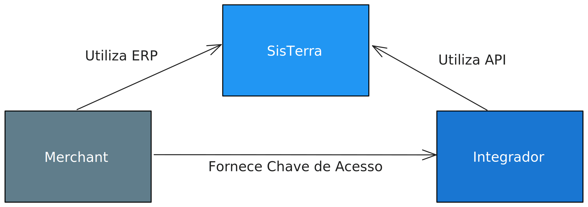

# Introdução

## Partes envolvidas
Para que uma integração com a [API do SisTerra](/) seja feita, há uma necessária cooperação entre partes distintas: [Merchant](#merchant), [Integrador](#integrador) e [SisTerra](#sisterra)



### Merchant
- Empresa parceira da [SisTerra](#sisterra)
- Parte que utiliza o [SisTerra](#sisterra) como seu software ERP
- Quando o [Integrador](#integrador) fizer uma requisição para a [API do SisTerra](/) os dados específicos deste [Merchant](#merchant) serão retornados
- Parte que fornece as [Chaves de Acesso](#chave-de-acesso) ao [Integrador](#integrador)

### Integrador
- Parte interessada em fazer a comunicação com a [API do SisTerra](/). Geralmente será uma empresa que é **parceira do Merchant**, também pode ser um setor interno do mesmo
- Responsável por desenvolver o **software integrador**, ou seja, aquele que fica entre o [Merchant](#merchant) e a [SisTerra](#sisterra)

### SisTerra
- Empresa que fornece o [Software ERP](https://www.sisterra.com.br) para o [Merchant](#merchant) e a [API do SisTerra](/) para o [Integrador](#integrador)
- A API disponibilizada pela [SisTerra](https://www.sisterra.com.br) fornece dados de todos os [Merchant](#merchant) vinculados à SisTerra. Isso significa que o [Integrador](#integrador) pode, com apenas uma integração, ter acesso aos dados de todos eles (desde que os mesmos forneçam as devidas [Chaves de Acesso](#chave-de-acesso))

### Chave de Acesso
- Uma chave e um secret que o [Merchant](#merchant) gerencia (criação e revogação) no [SisTerra](#sisterra) e compartilha com o [Integrador](#integrador)
- De posse dessa chave de acesso o [Integrador](#integrador) será capaz de fazer a [Autenticação](authentication.md) nas requisições que serão feitas para a API do SisTerra
- Exemplo:
```
key: 462003c5bf764809b1fb009364568e06
secret: 09296be46bd9409ca5fa406574f7f770
```